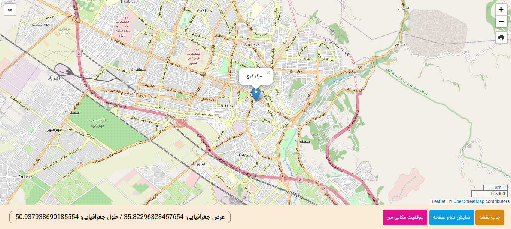

## Leaflet-Mapping-Class-Croject

Hello everyone,

This is a class project written using the JavaScript programming language and the leaflet library

## Screenshots

## 🚀 About Me

I'm front end developer and web designer

[@shrdaraee](https://www.github.com/shrdaraee)

## 🔗 My Social Media

